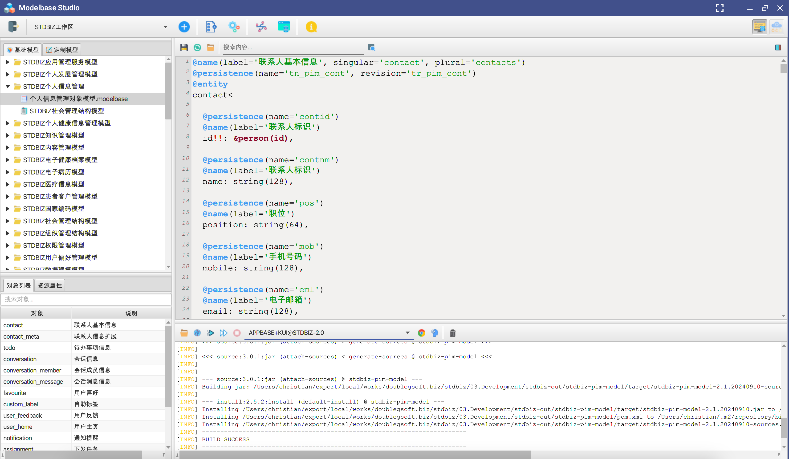
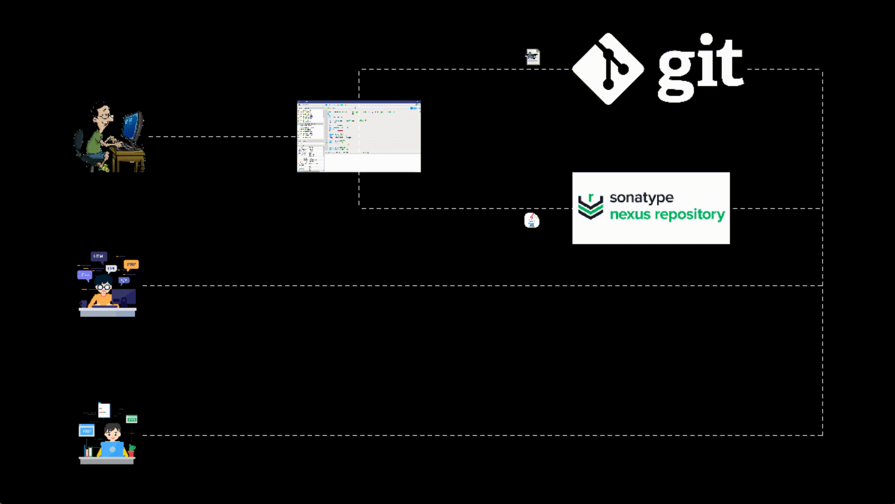
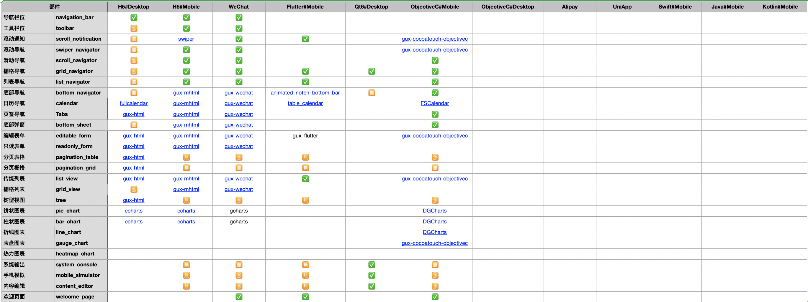

doublegsoft
===========

## Modelbase

Modelbase是设计用来描述领域模型的一种DSL语言，简单易用，容易理解并且上手。示例如下：

```

@name(label='联系人基本信息', singular='contact', plural='contacts')
@persistence(name='tn_pim_cont', revision='tr_pim_cont')
@entity
contact<
  
  @persistence(name='contid')
  @name(label='联系人标识')
  id!!: &person(id),

  @persistence(name='contnm')
  @name(label='联系人标识')
  name: string(128),

  @persistence(name='pos')
  @name(label='职位')
  position: string(64),

  @persistence(name='mob')
  @name(label='手机号码')
  mobile: string(128),

  @persistence(name='eml')
  @name(label='电子邮箱')
  email: string(128),

  @persistence(name='employorgid')
  @name(label='雇佣公司标识')
  @reference(value='id', name='employed_organization')
  employed_organization_id: string(64),

  @persistence(name='employorgtyp')
  @name(label='雇佣公司类型')
  @reference(value='type', name='employed_organization')
  employed_organization_type: string(64),

  @persistence(name='nt')
  @name(label='说明')
  note: string(1000),
  
  @persistence(name='modid', text='修改者标识')
  @reference(value='id', name='modifier')
  modifier_id: string(64),

  @persistence(name='modtyp', text='修改者类型')
  @reference(value='type', name='modifier')
  modifier_type: string(64),

  @persistence(name='sta', text='系统状态')
  state: state,
  
  @persistence(name='lmt', text='最近修改时间')
  last_modified_time: now
>
```

我们的思路是通过

```
model + best practice = source code
```

Modelbase Studio界面，通过此软件，我们把model转换成那个java和其他语言形式的代码，把java代码编辑打包发布到maven库中，其他脚本形式的代码则发布到git库中。



Modelbase给团队开发带来的增益流程



## Guidbase

Guidbase是一套设计用户描述界面的DSL语言，示例如下:

```
home:page(title:"首页", navigable:"true", headless:"true", index:"1")<
  navigation_bar<
  	name:text,
  	calendar_and_program:toolbar<
  	  button_calendar:button(title:"今日"),
  	  button_program:button(title:"某某营养计划")
  	>
	>,
	notif:scroll_notification,
	row<
	  col(width:"4")<
	    image:image
	  >,
	  list_metrics:list_navigator(title:"还可以吃", width:"10")<
	    tile<
	      name:text(title:"能量", unit:"kcal", level:"primary"),
        value:progress(level:"accent")
	    >,
	    tile<
        name:text(title:"碳水", unit:"g", level:"primary"),
        value:progress(level:"accent")
      >,
      tile<
        name:text(title:"脂肪", unit:"g", level:"primary"),
        value:progress(level:"accent")
      >,
      tile<
        name:text(title:"蛋白质", unit:"g", level:"primary"),
        value:progress(level:"accent")
      >
	  >,
	  list_meals:list_navigator(title:"饮食记录", width:"10")<
	    toolbar<
	      button_meal_report:button(title:"饮食报告",url:"$ehr/meal/daily?personId")
	    >,
	    tile<
        text(title:"早餐", level:"primary"),
        button_breakfast:button(title:"去记录", level:"accent", url:"^meal_editor?type=breakfast&personId")
      >,
      tile<
        text(title:"午餐", level:"primary"),
        button_lunch:button(title:"去记录", level:"accent", url:"^meal_editor?type=lunch&personId")
      >,
      tile<
        text(title:"晚餐", level:"primary"),
        button_dinner:button(title:"去记录", level:"accent", url:"^meal_editor?type=dinner&personId")
      >
	  >
	>,
	grid_metric:grid_navigator(title:"日常指标记录", columns:"3")<
    toolbar<
      button_more_metrics:button(title:"更多信息", url:"$ehr/measurement/list")
    >,
    blood_liquids:tile(url:"^measurement_editor?type=BL")<
      text(title:"血脂", level:"primary"),
      button_edit:switch
    >,
    blood_sugar:tile(url:"^measurement_editor?type=BS")<
      text(title:"血糖", level:"primary"),
      button_edit:switch
    >,
    blood_pressure:tile(url:"^measurement_editor?type=BP")<
      text(title:"血压", level:"primary"),
      button_edit:switch
    >,
    weight:tile(url:"^measurement_editor?type=WT")<
      text(title:"体重", level:"primary"),
      button_edit:switch
    >,
    steps:tile(url:"^measurement_editor?type=ST")<
      text(title:"步数", level:"primary"),
      button_edit:switch
    >
  >,
  list_nutrient:list_view(title:"营养元素记录",url:"/api/v3/common/script/stdbiz/ehr/dietary_supplement/paginate", top:"5")<
    toolbar<
      button_more_nutrients:button(title:"更多信息", url:"$ehr/dietary_supplement/list")
    >,
    tile<
      nutrient_name:text(level:"primary"),
      amount:text(level:"secondary")
    >
  >,
  list_doctor:list_view(title:"推荐营养师", url:"/api/v3/common/script/stdbiz/his/doctor/paginate", top:"3")<
    toolbar<
      button_more_doctors:button(title:"更多", url:"$his/doctor/list")
    >,
    tile(url:"$his/doctor/detail?doctorId")<
      person_name:text(level:"primary"),
      position:text(level:"secondary"),
      description:text(level:"tertiary"),
      avatar:image(level:"avatar")
    >
  >,
  grid_program:grid_navigator(columns:"2")<
    button_one:tile(url:"$ehr/nutrition_program/detail?nutritionProgramId=2")<
      name:text(level:"primary",title:"营养计划详情"),
      description:text(level:"secondary")
    >,
    button_two:tile(url:"$ehr/nutrition_program/detail?nutritionProgramId=1")<
      name:text(level:"primary", title:"营养计划详情"),
      description:text(level:"secondary")
    >
  >,
  list_program:list_view(title:"营养计划", url:"/api/v3/common/script/stdbiz/ehr/nutrition_program/paginate", top:"5")<
    toolbar<
      button_more_programs:button(title:"更多信息", url:"$ehr/measurement/list")
    >,
    tile(url: "$ehr/nutrition_program/detail?nutritionProgramId", title:"营养计划详情")<
      program_name:text(level:"primary"),
      image:image(level:"image"),
      view:button(level:"accent", title:"查看")
    >
  >,
  list_article:list_view(title:"健康文章", url:"/api/v3/common/script/stdbiz/cm/article/pagination",top:"5")<
    toolbar<
      button_more_articles:button(title:"更多信息", url:"$cm/article/list")
    >,
    tile(url: "$common/article?articleId", title:"健康文章详情")<
      article_name:text(level:"primary"),
      image:image(level:"image"),
      summary:text(level:"secondary"),
      published_date:date(level:"tertiary")
    >
  >,
  meal_editor:bottom_sheet(title:"膳食填写", height:"400")<
    form_meal:editable_form(columns:"1")<
      meal:segment(values:"[B:早餐,L:午餐,D:晚餐]"),
      images:images
    >,
    button_save:button(title:"保存",url:"/api/v3/common/script/stdbiz/ehr/daily_meal_recrord/save@form_meal$common/success")
  >,
  measurement_editor:bottom_sheet(title:"指标填写", height:"300")<
    form_measurement:editable_form(columns:"1")<
      meal:segment(values:"[B:早餐,L:午餐,D:晚餐]"),
      images:images
    >,
    button_save:button(title:"保存",url:"/api/v3/common/script/stdbiz/ehr/daily_meal_recrord/save@form_measurement$common/success")
  >
>
```

## GUIDBASE的落地辅助框架 GUX

